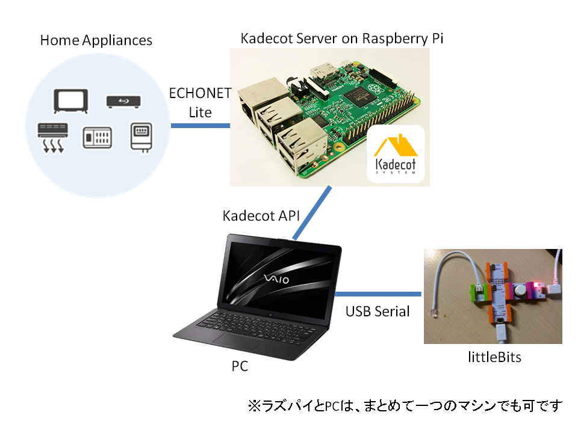

# littleBitsとKadecotでECHONET Lite家電の制御

littleBitsのBITS MODULES W6 ARDUINOと、Kadecotを使ってECHONET Lite家電を動かすデモを作った。

(YouTube ビデオへのリンク)

## 使ったもの
* ECHONET Liteの照明とエアコン
* littleBits (Arduino, ボタン, LED)
* Kadecot|JS
* Raspberry Pi
* Chrome Packaged App (シリアルを読み書きして、Kadecot APIをたたく)

## 構成図

ECHONET Liteプロトコルは、ラズパイ上で動作する[Kadecot|JS](https://github.com/SonyCSL/Kadecot-JS)により[Kadecot API](http://kadecot.net/webapi/) (WebAPI)に変換される。

WebAPIはWebSocketを使用しており、PC上で動作するChrome Packaged Appから接続される。WAMP RPCによって機器を操作でき、WAMP PubSubによって機器の状態変更通知を受け取ることができる。詳細は[ECHONET Lite公式ドキュメント](http://echonet.jp/spec/)を参照のこと。

Chrome Packaged Appはシリアルポートにもアクセスして、littleBitsのArduinoからの入力を得たり、LEDを光らせるためにlittleBitsに信号を送ったりする。

PCはChromeが動けばOSの種類は問わない。ラズパイ自身でPCの代替をすることも可能だと思う（やったことはないが）

## リポジトリ構成

* arduinobit/
littleBitsのArduinoに書き込むスケッチが入っている。ボードはArduino Leonardにすること。
* chromeserialecho/
シリアルとKadecot APIにアクセスするChrome Packated App。

詳細はソースコードを見てみてください。意外に簡単かもしれません。
